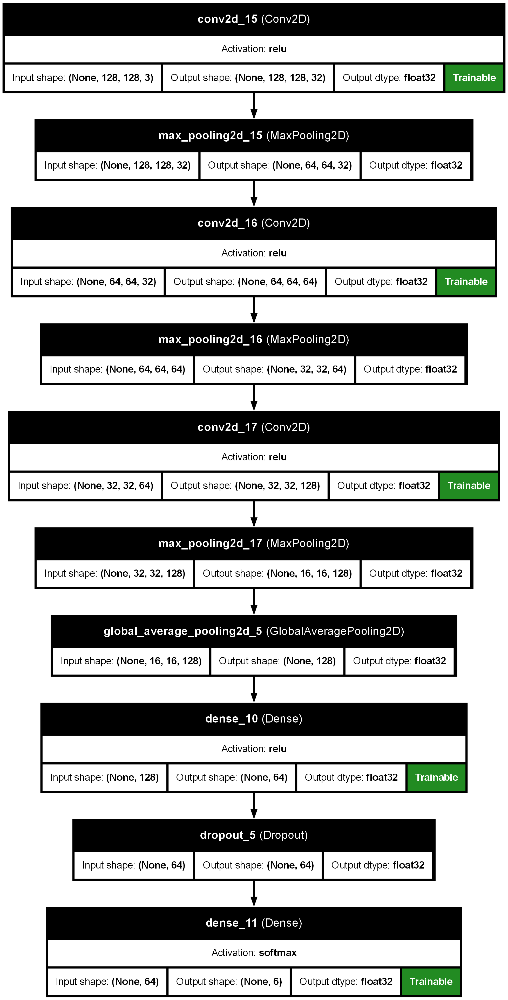
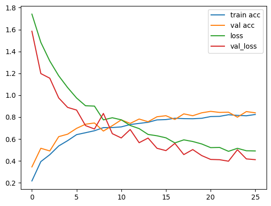

# How To

* Setup

you have to install python and set it up first !
``` bash
    pip pip install -r requirements.txt
```
* Running Server 
``` bash
    cp .env.example .env #copy .env.example to .env

    flask run #listen only to your local machine
     
    #or

    flask run --host=0.0.0.0 #listen on your lan
```
Flask guide : https://flask.palletsprojects.com/en/stable/quickstart/

## Interact with model

You can train or tweak the model easily with jupyter notebook
 - Open file  ```.ipynb``` in directory ```thisproject/notebook/anything.ipynb``` with vscode or jupyter notebook server


## Model structure


## Model accuracy

